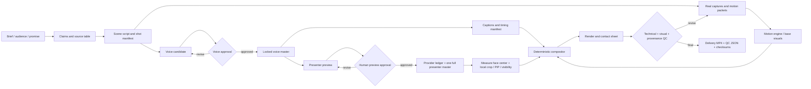

# Digital Human Video Production

> An integrated Codex Skill for end-to-end presenter-led video production — from locked voice masters and avatar previews to structured motion and auditable final deliverables.

This reusable skill targets Codex / local production workflows and turns a project brief, an approved narration master, an avatar or live presenter, real product captures, and deterministic motion/compositing into a deliverable video.

It is provider- and brand-neutral. Project-specific facts, copy, colors, fonts, media, and provider parameters live in each project's directory; the repository keeps only reusable logic, scripts, and validation rules.

## Demo

This demo is a project-level example (not normative skill content). It demonstrates:

- local voice cloning with phrase-level speed adjustments while preserving breaths and non-uniform inhalations;
- a single presenter/ avatar master generation followed by local visibility, crop, and picture-in-picture (PIP) composition;
- choreography of real product pages and structured information cards;
- PIP transitions from a full opening frame into a corner inset;
- subtitle, audio, frame, and final-delivery QC.

[Watch / Download the v0.2 demo (1080p)](https://github.com/jaxxchen003/digital-human-video-production/releases/download/v0.2.0/digital-human-video-production-demo-v0.2.mp4)

The public demo shows the general production chain: 16:9, 1920×1080, 30fps, ~121s, H.264/AAC. Content, pages, and visuals are illustrative and not intended as reusable brand assets.

## v0.2 — Additions derived from full production

- One full-master budget: after a short preview is human-reviewed, the same audio checksum permits at most one submitted or completed presenter master; shot-level edits remain local.
- Auditable provider ledger: records preview/full-master submissions, approval references, media durations and SHA-256 checksums; repeated complete generation must include a declared exception reason.
- Measured PIP cropping: calculate source crop, corner coordinates, and output error from multiple face-center measurements rather than assuming `object-fit: cover` centers the subject.
- Dual-view borderless transitions: full-frame and measured-crop views use the same master and timeline with synchronized muted crossfades to avoid black edges or framing jumps when scaling.
- Enhanced delivery QC: full decode pass, audio/visual duration sync, EBU R128 loudness, black-frame and freeze detection, presenter-master freeze checks, designed readable-hold classification, contact sheet, and three primary media checksums in a single output.

## Capabilities

| Capability | Artifact | Key constraint |
| --- | --- | --- |
| Brief & fact management | project manifest, source table, shot/timeline script | Every important assertion must have a source and reviewer |
| Voice cloning | candidate audio, locked master, generation manifest | The locked voice master establishes the visual timing |
| Presenter/ avatar rendering | preview, full presenter master, approval events | Generate a short preview first, then exactly one full master |
| Provider cost & state | private JSONL ledger | The same locked audio checksum defaults to a single submitted or completed full-master job |
| Motion shot design | shot manifest, scene packet, caption timing | One primary action per shot with subsequent readable hold |
| Local composition | measured crop, PIP schedule, captions, final MP4 | Reuse muted presenter master, do not obscure page, URL, code, or captions |
| MCP / connector demo | sanitized request/response screenshots | Do not show tokens, cookies, private slugs, or raw headers |
| QC & delivery | contact sheet, QC JSON, checksums | Distinguish freeze frames from declared readable holds |

## Dependencies & reference architecture

This skill documents a reproducible reference stack and keeps clear adapter boundaries. The list below describes production tools and runtime dependencies, not the brands shown in a demo.

### Reference implementation stack

| Layer | Recommended | Responsibility | Required? | Replaceable boundary |
| --- | --- | --- | --- | --- |
| Voice | VoxCPM / VoxCPM2 (local voice clone) | Produce locked WAV, phrase-level timing, and generation manifest | Reference path required | Any engine that outputs deterministic WAV + manifest |
| Presenter / avatar | HeyGen Photo Avatar / Avatar API | Use locked audio to render a 12–15s preview, then a full presenter master | Recommended by reference | Local renderer or filmed presenter may replace it |
| Motion | HyperFrames + GSAP runtime | Organize scene packets, information hierarchy, and seek-safe motion | Reference runtime | Other motion runtimes that support scene packets |
| Composition | Remotion | Deterministic composition of measured PIP, captions, and audio | Reference path required | FFmpeg filter graph, NLE, or other deterministic compositor |
| Media & QC | FFmpeg / ffprobe + Python | Encoding, full decode, loudness, black frames, freeze detection, contact sheets, checksums, and QC JSON | Provided in this repo | Any toolchain that reproduces these checks |
| Subtitles / alignment | Whisper or other ASR | Word-level timestamps, captions, and narration alignment checks | Optional | Any ASR that produces auditable timestamps |

Typical reference flow:

```text
VoxCPM locked WAV
  → HeyGen preview & full presenter master
  → HyperFrames + GSAP scene packet / base motion
  → Remotion PIP, captions & deterministic composition
  → FFmpeg / ffprobe encode & QC
```

The table above maps which tool addresses which engineering problem; it does not prescribe which brand name must appear in the final video. Provider account details, HeyGen avatar/profile IDs, VoxCPM weights, reference audio, and project pages remain private.

### Runtime dependencies & private boundaries

- Python 3: run the repository's standard-library scripts;
- ffmpeg / ffprobe: media metadata, full decode, loudness, black/freeze detection, contact sheets and delivery checks;
- Node.js / npm: run Remotion or other React/TypeScript compositors;
- HyperFrames CLI/checker and its animation runtime (the reference uses GSAP);
- HeyGen account / Avatar API or an authorized application workflow, called only from a private project adapter;
- VoxCPM / VoxCPM2 local runtime, model weights and reference audio, managed by a private project runbook;
- Browser capture, design exports, or asset libraries for real product pages and licensed media;
- Optional Git LFS, object storage, or GitHub releases for large demo media;
- Optional MCP / connector client for demonstrating sanitized requests or publishing results.

The public repository provides interfaces, scripts, rules, and validation methods only; it does not include provider SDKs, upload logic, credentials, model weights, or customer media. Any uploads of customer audio, faces, or private media must remain within a project's private runbook.

See `references/dependencies.md` for a fuller description of inputs/outputs, license boundaries, and reference projects.

## Installation & usage

```bash
git clone https://github.com/jaxxchen003/digital-human-video-production.git
cd digital-human-video-production

# Validate the skill structure (requires the Codex skill-creator quick_validate.py)
python3 /path/to/quick_validate.py .

# Create a project skeleton without media
python3 scripts/init_project.py \
  --path ./my-video \
  --title "Product explainer"

# Generate a presenter layout schedule from scene boundaries
python3 scripts/build_avatar_schedule.py \
  --duration 120 \
  --scene-ends "24,48,72,96" \
  --left-scenes "3" \
  --output ./my-video/config/avatar-schedule.json

# Compute stable source crop and PIP geometry from multiple face-center measurements
python3 scripts/build_pip_geometry.py \
  --measurements ./my-video/config/pip-face-centers.json \
  --pip-diameter 220 \
  --output ./my-video/config/pip-geometry.json

# Record a provider job in a private ledger (this script does not call or upload to providers)
python3 scripts/record_provider_job.py \
  --log ./my-video/logs/provider-generation.jsonl \
  --provider avatar-provider \
  --stage preview \
  --status completed \
  --audio ./my-video/audio/narration-master.wav \
  --output ./my-video/presenter/preview.mp4

# Run delivery validation on final media
python3 scripts/validate_delivery.py \
  --video ./my-video/deliverables/final.mp4 \
  --voice-master ./my-video/audio/narration-master.wav \
  --presenter-master ./my-video/presenter/master.mp4 \
  --approved-holds ./my-video/config/approved-holds.json \
  --contact-sheet ./my-video/deliverables/contact-sheet.jpg \
  --output ./my-video/deliverables/qc.json
```

In Codex the skill invocation is:

```text
Use $digital-human-video-production to produce a verified presenter-led product video.
```

Project-specific provider commands, model parameters, accounts, asset paths and product facts must remain in the project's private runbook.

## Workflow chain



Core principles: lock the voice before scheduling the timeline; generate only one full presenter master; reuse the muted presenter video for composition; perform all shot-level layout, crop and motion locally.

## Rules

### Content & facts

1. Every load-bearing claim must have a source, retrieval timestamp, and a named reviewer.
2. Prefer real product captures; mark illustrative or mock images explicitly as such.
3. Do not infer product capabilities, permissions, formats, or access rules from screenshots alone.
4. Project variables live in local manifests; the public skill contains no brand, customer content, or client scripts.

### Voice & presenter

1. The narration master is the single timing authority — any audio change reopens timeline review.
2. Speed adjustments apply only to phrase regions; breaths, pauses, and inhalations are preserved or handled explicitly.
3. Render a 12–15s presenter preview first, then produce exactly one full presenter master.
4. Check for consistent timbre, lip-sync, eye contact, micro-expressions, gestures, and freeze frames before approval.
5. The provider ledger keys entries by locked audio checksum and prevents duplicate paid full-master submissions before an explicit exception is recorded.
6. Provider job records, avatar/asset IDs, API keys and raw responses remain private.

### Shots & motion

1. Each shot should have a single primary action: place, draw path, split-compare, input, parse, or deliver.
2. After the action completes, provide a readable hold rather than endlessly filling time with drifting motion.
3. The presenter is the narration layer and must not obscure page core elements, URLs, code blocks, or captions.
4. PIP size, corner radius, position, caption keep-out, and visibility rules are fully configurable.
5. Calculate crop from multiple measurements of the subject, rather than assuming `object-fit: cover` centers correctly.
6. Keep provider presenter video muted; the locked WAV is the single source of audio timing.
7. Prefer real pages, clear hierarchy, and restrained transitions; avoid heavy shadowing, gratuitous glow, or template cascades.

### Privacy & copyright

1. Do not submit audio, video, customer pages, private screenshots, tokens, cookies, or `.env` files to the public skill repository.
2. Record fonts, logos, music, SFX, models and page assets with clear licensing and attribution.
3. Store large demo media in Git LFS, Releases, or object storage; demo media released with this repository is an example and not part of the core skill.

## Quality control

### Automated checks

```bash
python3 /path/to/quick_validate.py .
python3 -m py_compile scripts/*.py tests/*.py
python3 -m unittest discover -s tests -v
python3 scripts/validate_delivery.py \
  --video deliverables/final.mp4 \
  --voice-master audio/narration-master.wav \
  --presenter-master presenter/master.mp4 \
  --approved-holds config/approved-holds.json \
  --contact-sheet deliverables/contact-sheet.jpg \
  --output deliverables/qc.json
```

Projects should also run linting, type checks, a bundle/render smoke test, and motion validation. Default media checks include:

- video encoding, resolution, framerate, rotation metadata and duration limits;
- audio encoding, sample rate, channels, loudness and true peak;
- full decode, black-frame events, missing streams, abnormal frozen frames and file integrity;
- presenter-master freeze frames must be zero; final-render freezes are allowed only when matched to declared readable-hold intervals;
- duration sync between locked voice, presenter master and final video within project tolerance;
- SHA-256 checksums for the final video, voice master and presenter master;
- presence of manifest, tool versions, approval events, and provenance records.

### Human review

Watch the opening, the presenter transition into PIP, each major surface, dense information segments, connector results, and the close. Confirm:

- captions align to audio and that English URLs / commands are not broken across lines;
- presenter lip-sync, eye contact, expression and breathing feel natural; there are no obvious freezes;
- PIP does not obscure core content and each motion leaves sufficient readable hold time;
- page assets, fonts, colors, material licensing and product facts match the project manifest;
- outputs remain legible in the target player and at delivery sizes.

Any missing checks must cause the deliverable to be labeled `preview` or `candidate`, not `final`.

## Motion forms

Choose from the following motion forms and restyle them to a project's visual system:

- Card placement: multiple inputs enter fixed slots and form a structured relationship;
- Path draw: advance through processing stages from input to user-visible result;
- Split-screen comparison: keep a shared coordinate system and compare options side-by-side;
- Input → confirm → result: real field input, a single action, state confirmation and result parsing;
- Anchor loop: keep the core page stable while surrounding context, audience, or states rotate;
- Presenter PIP: short settle, angle change, hiding and reappearance from full-frame to inset;
- Delivery focus: remove non-essential chrome and leave only URLs, results or a CTA.

## Motion & process references

- video-shotcraft: shot cards, single action, readable hold and Remotion screen grammar;
- HyperFrames Motion Director: brief, storyboard, design-engineering contract and review gates;
- HyperFrames Motion Library: parameterized templates, transparent overlay formats and local template library;
- Rachel Digital Human Production: pre-submit checks, 15s preview and job state recording.

These repositories are method references only, not runtime dependencies. Do not copy brand assets or fixed templates.

## Repository layout

```text
.
├── SKILL.md
├── agents/openai.yaml
├── references/
│   ├── production-contract.md
│   ├── dependencies.md
│   ├── voice-pipeline.md
│   ├── avatar-pipeline.md
│   ├── provider-job-ledger.md
│   ├── presenter-compositing.md
│   ├── motion-pipeline.md
│   ├── qc-checklist.md
│   └── mcp-connector-handoff.md
├── scripts/
│   ├── init_project.py
│   ├── build_avatar_schedule.py
│   ├── build_pip_geometry.py
│   ├── record_provider_job.py
│   └── validate_delivery.py
├── tests/
│   └── test_scripts.py
├── LICENSE
└── README.md
```

## Future work

- multi-aspect profiles: automatic remapping of safe areas and measured PIP geometry for 16:9, 9:16, 4:5, and 1:1;
- provider adapters: unify local models, avatar APIs, live capture and different compositors behind a single adapter;
- schema-first timeline: validate manifest, approval events, shot packets and QC reports with JSON Schema;
- voice quality improvements: automatic detection of timbre drift, abnormal pauses, ASR similarity and multilingual captions;
- visual regression: automated subject detection, keyframe difference checks, occlusion detection, caption safe-area and page readability scoring;
- approval & release: chain brief, audio, avatar preview, timeline, QC and release assets into an auditable event stream;
- cost & cache: add real costs, quotas and reusable-asset hit rates to the provider ledger.

## License

Apache License 2.0. Project media, fonts, models, logos, screenshots and third-party assets are not automatically redistributed by this repository's license.
